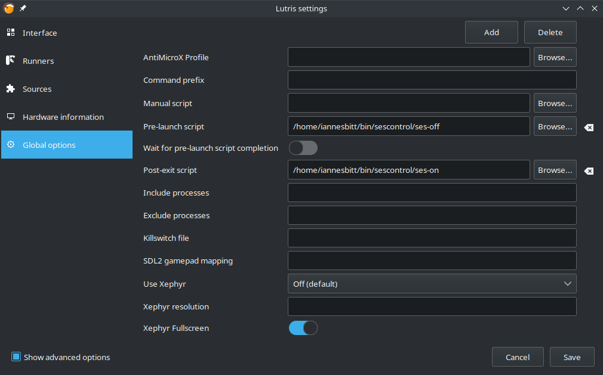

# sescontrol
*One-liner sed commands to turn the KDE Screen Energy Saving setting on or off*

KDE Plasma sometimes overrides application requests to keep the screens on.
This can be a hassle to deal with when using multimedia or gaming applications.
These scripts are one-liner `sed` commands that control the Screen Energy Saving
(SES) setting config.

Plasma's energy settings are generally stored in `$HOME/.config/powermanagementprofilesrc`.
If the sed command in `ses-off` finds them, it will comment out the following lines:

```
[AC][DPMSControl]
idleTime=600
```

Conversely, `ses-on` will uncomment those lines if they are found commented.

The effect of this will be to turn the Screen Energy Saving setting on or off
in `System Settings > Hardware > Power Management > On AC Power`.

You can use these as pre-launch and post-exit for multimedia applications like
VNC, gaming applications like Lutris, and anything else that requires constant
uninterrupted screen usage in KDE.


# Usage
## Turning SES off

Run both of these commands like a normal shell script:

```
bash ./ses-off
```

Resulting settings:


## Turning SES on

```
bash ./ses-on
```

Resulting settings:


# Pre-launch and post-exit configuration
## Lutris

Fields found in `Menu > Preferences > Global Settings > Pre-launch/Post exit script`




## Potential VLC setup

VLC contains no pre-launch or post-exit setting fields, but users can start VLC
using other means. For example, redefining the vlc command in `.bash_aliases`:

`echo "alias vlc='ses-off; vlc; ses-on'" >> ~/.bash_aliases`

This will change the function of the `vlc` command to be wrapped in sescontrol
commands, so the screens should not power off as long as that process exists.

This of course requires the `ses-off` and `ses-on` scripts to be somewhere on
the user's `$PATH`. I like to append `~/bin` to my path so that any script or
link in that folder will be accessible by its basename.

There are surely better ways to achieve this outcome, but this will work as a
basic measure.

# Attribution

The sed command used in these scripts was adapted from a
[StackOverflow answer](https://stackoverflow.com/a/30646076/4648080) from user
nu11p01n73R.